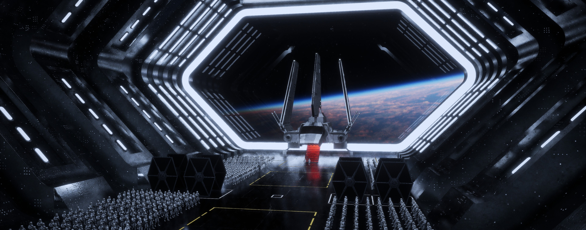

# Star Wars Cinematic — Unreal Engine 5

A cinematic Unreal Engine tutorial project focused on large-scale composition, lighting, and storytelling through visuals.  
This project explores atmosphere, scale, and cinematic language inspired by sci-fi military formations.

---

## 🎬 Project Overview

- **Engine:** Unreal Engine 5.3
- **Project Type:** Cinematic / Non-Interactive
- **Platform:** Windows
- **Status:** Completed / Portfolio Project
- **Focus:** Visual storytelling, cinematic composition, rendering

This is **not a game**.  
The goal was to push cinematic quality, scene composition, and rendering inside Unreal Engine using real-time tools.

---

## 🖼️ Visual Preview
Cinematic frames rendered directly from Unreal Engine using Sequencer and Cinematic Cameras.

### Environment

### Large-Scale Formation

### Character Close-Up

### Shuttle Arrival Shot

---

## 🧠 What I Learned From This Project

This project was built as a **learning-driven cinematic**, covering the full real-time pipeline:

### 🔹 Modeling
- Working with high-poly and mid-poly assets
- Importing and optimizing external meshes
- Managing scale consistency across large scenes

### 🔹 Lighting
- Cinematic lighting setups
- Practical vs stylized lighting decisions
- Depth, contrast, and subject separation
- Using light to guide viewer focus

### 🔹 Scene Decoration
- Large-scale environment composition
- Repetition handling
- Set dressing for cinematic framing

### 🔹 Animation & Sequencer
- Sequencer workflow
- Character and crowd animation timing
- Shot-based storytelling
- Coordinating animation with camera movement

### 🔹 Camera, Rigs & Cinematics
- Cinematic Camera Actors
- Depth of field
- Camera blocking and movement

### 🔹 Rendering
- Real-time cinematic rendering
- Final output preparation for video

---

## 📁 Repository Structure
├── Content/        
├── Config/        
├── .gitignore  
├── .gitattributes  
├── README.md  
└── *.uproject  
